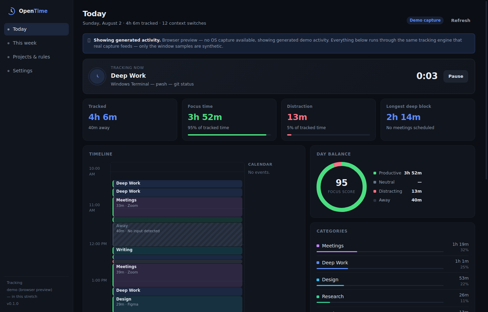
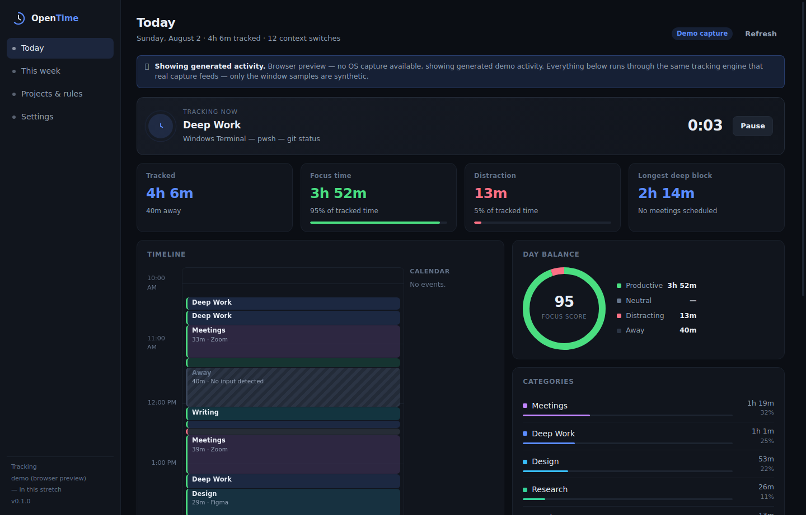

# OpenTime

A lean, local-first automatic time tracker for Windows and macOS.

OpenTime runs quietly in the tray, notices which application and window you are
actually working in, and turns that into a timeline, a category breakdown, and a
focus score — with your calendar overlaid beside it. No timers to start. No
screenshots. No account, no server, no subscription: everything stays in a file
on your machine.



---

## Contents

- [What it does](#what-it-does)
- [Running it](#running-it)
- [Architecture](#architecture)
- [Performance notes](#performance-notes)
- [Storage, and the SQLite migration path](#storage-and-the-sqlite-migration-path)
- [Google Calendar](#google-calendar)
- [Privacy](#privacy)
- [Packaging for Windows and macOS](#packaging-for-windows-and-macos)
- [Testing](#testing)
- [What v0 does not do yet](#what-v0-does-not-do-yet)
- [Relationship to the older Norte tracker](#relationship-to-the-older-norte-tracker)

---

## What it does

**Automatic tracking.** A background loop samples the OS focused window every few
seconds and groups consecutive samples into sessions. Nothing to start or stop.

**Idle detection.** When the OS reports no keyboard or mouse input for longer
than your threshold, the open session closes at its last observed sample and the
loop drops to a 30-second heartbeat that does nothing but watch for your return.
Time away is recorded as an explicit *Away* block, never as work.

**Categorisation.** Sessions resolve to a category through a fixed precedence:
an explicit per-app rule, then a learned keyword rule, then your project
keywords, then `Uncategorized`. Correct a block on the timeline, choose "Whole
app" or "Matching text", and the correction becomes a permanent rule.

**Focus and distraction.** Every session is classified productive / neutral /
distracting. The daily focus score is the productive share of tracked time,
scaled down by how fragmented that time was — the same four hours score worse
when they were chopped into forty pieces.

**Calendar overlay.** Meetings render beside the timeline, so time in meetings
and time in deep work are visible against each other.

**Weekly view.** Seven-day totals, per-day stacked bars, category rollups, and
the average focus score.



---

## Running it

Requires Node 20+.

```bash
npm install          # the native capture module is an optionalDependency; a failure here is not fatal
npm run dev          # Vite dev server + esbuild watch + Electron
npm test             # unit tests (111, no Electron needed)
npm run typecheck    # tsc --noEmit
npm run build        # production build into dist/
npm start            # build, then run the app
```

Useful extras:

```bash
npm run package:win  # NSIS installer
npm run package:mac  # dmg
npx electron scripts/screenshot.cjs docs/screenshots   # capture the UI headlessly
```

### If OS capture is not available

`@miniben90/x-win` reads the focused window on Windows, macOS and X11. It cannot
work on Wayland, in containers, or over most remote sessions — Wayland does not
expose the focused window to other applications at all.

On those systems OpenTime does not fail: it falls back to a **demo capture
adapter** and seeds a fortnight of realistic history, so the app is fully usable
and reviewable. A banner on the Today view says so explicitly, and Settings
names the adapter in use. The demo data is generated through the *real*
`SessionBuilder`, so only the window samples are synthetic — every line of
categorisation, splitting and aggregation is the shipping code.

One detail worth knowing: the native module is probed **in a child process**.
It is a Rust addon, and on an unsupported session it does not throw — it panics,
which aborts the host process. A panic unwinding through napi cannot be caught
by `try/catch`, so probing in-process would kill the app at boot on exactly the
machines that need the fallback. See `src/main/capture/index.ts`.

---

## Architecture

```
src/
  core/          pure logic — no Electron, no I/O, no DOM. Shared by main and renderer.
    types.ts       domain types (the IPC contract's vocabulary)
    day.ts         tracking-day math (configurable rollover hour, local time only)
    categorize.ts  rule precedence + productivity classification
    sessions.ts    SessionBuilder: samples in, batched sessions out
    aggregate.ts   every number the dashboard shows
    demo.ts        seeded generator for demo history and the demo adapter
    defaults.ts    factory settings, projects, seed rules
  main/          Electron main process
    main.ts        window, tray, IPC, boot
    tracker.ts     the active/idle polling state machine
    capture/       Capture interface + native and demo adapters
    storage/       Storage interface + JSON implementation
    calendar/      Google OAuth wiring and Calendar REST client
  preload/       contextBridge surface (the only thing the renderer can reach)
  renderer/      React 18 + Vite
    state/         one data hook, plus a browser-only fallback client
    components/    Now card, timeline, charts, inspector
    views/         Today, This week, Projects & rules, Settings
  shared/ipc.ts  channel names and the typed API both sides implement
tests/           vitest, node environment
```

Three deliberate boundaries:

1. **`core/` imports nothing.** No Electron, no `fs`, no React. That is why the
   engine is testable without a display, and why the renderer can reuse the exact
   aggregation the main process would compute.
2. **Everything external to `Tracker` is injected** — capture source, idle
   seconds, storage, clock. The whole idle/active state machine runs in tests
   with a fake clock and no real timers.
3. **`Storage` is an interface**, and it exposes only append and per-day read.
   That is the entire query surface the engine needs, which is what makes the
   backend swappable.

Security posture in the renderer: context isolation on, node integration off, a
strict CSP in `index.html`, and `setWindowOpenHandler` sending external links to
the system browser instead of opening an in-app window.

---

## Performance notes

The predecessor to this app was sluggish, and most of that was things that had
no business being in a time tracker's process. The rules here:

**Nothing unrelated ships.** No browser automation, no webcam/vision pipeline,
no speech models, no agent framework, no video sub-application. Runtime
dependencies: **zero**, plus one optional native module for window capture.
React and Vite are dev dependencies that compile away into a single bundle.

**Writes are batched twice over.** `SessionBuilder` holds one session in memory
and only emits when the category changes, a sampling gap opens, or the caller
flushes — an hour of unbroken work is one write, not 720. `JsonStorage` then
coalesces mutations into a single debounced atomic write. A test asserts that a
full minute of polling persists nothing.

**Idle costs nothing.** When the OS reports idle, the sampling interval is torn
down and replaced with a 30-second heartbeat that reads one integer. The capture
module is not touched at all while you are away, and neither is the disk.

**The renderer never aggregates in a component body.** Every summary comes from
a `useMemo` keyed on payload identity. The one per-second timer in the app lives
inside `NowCard`, so the ticking clock re-renders one component rather than the
dashboard. Timeline geometry is precomputed as fractions by `buildTimeline`, so
rendering is a multiply — no layout measurement, no `getBoundingClientRect`, no
resize observers.

**The bundle is one file.** ~187 kB of JS (~59 kB gzipped) and ~12 kB of CSS,
no code splitting: this loads over `file://`, so there is no network waterfall
to optimise and one file parses fastest. Main and preload are built separately
with esbuild in ~10 ms, so a renderer change never rebuilds the main process.

**The window is allowed to be throttled.** `backgroundThrottling` stays on;
tracking lives in the main process and does not need the window awake.

---

## Storage, and the SQLite migration path

v0 persists to a single JSON file in Electron's `userData` directory
(`%APPDATA%/OpenTime` on Windows, `~/Library/Application Support/OpenTime` on
macOS), written atomically via tmp-file + rename. A corrupt file is renamed
aside rather than crash-looping the app at boot.

This is honest about its limits: the whole store is held in memory, which is
right for one user's months of sessions and wrong for years of them.

The migration path is already in place, and it is why `Storage` looks the way it
does:

| Concept | JSON today | SQLite later |
|---|---|---|
| `appendSessions` | push into a day-keyed array | `INSERT` into `sessions` |
| `getSessions(day)` | array lookup | `SELECT … WHERE day_key = ?`, indexed |
| `updateSession` | splice in place | `UPDATE … WHERE id = ?` |
| `putEvents(day, …)` | replace array | `DELETE` + `INSERT` in one transaction |
| settings / projects / rules | object fields | small key-value or typed tables |

Swapping in `better-sqlite3` means writing one new `Storage` implementation and
changing one line in `main.ts`. Nothing in `Tracker`, the IPC layer or the
renderer refers to the JSON shape. The interface deliberately never returns the
whole `Record<string, Session[]>`, so a backend is free to answer per-day queries
from disk. A one-time importer would read the JSON file and replay it through
`appendSessions`.

`better-sqlite3` was *not* adopted for v0 on purpose: it is a native module
needing a per-Electron-ABI rebuild, and this prototype had to be reviewable on a
machine where native modules do not load.

---

## Google Calendar

OpenTime ships **no API credentials**. You create a free OAuth client in your own
Google Cloud project and paste it into Settings; it is stored only in your local
settings file and sent nowhere but Google.

Setup:

1. Google Cloud Console → new project → enable the **Google Calendar API**.
2. Credentials → **OAuth client ID** → application type **Desktop app**.
3. Add `http://127.0.0.1:47813/oauth/callback` as an authorised redirect URI.
4. Paste the client ID and secret into OpenTime → Settings → Google Calendar,
   then press **Connect**.

Scope defaults to `calendar.readonly`, which is all the overlay needs and is the
lighter path through Google's verification review. Read-write is selectable for
future write-back features.

Two implementation details, both carried over from a previous implementation
that had already hit them:

- **The auth window presents a Chrome user agent.** Google rejects OAuth in a
  window advertising Electron's default UA. The flow runs in a dedicated
  `BrowserWindow` presenting a normal Chrome UA while sharing the default
  session, so an existing Google login carries over.
- **Tokens refresh five minutes before expiry**, and an `invalid_grant` (the
  user revoked access) flips the account to disconnected instead of retrying a
  grant that will never succeed again.

Plain `fetch`, no `googleapis` SDK — one HTTP call does not justify several
megabytes in a process we want to stay small.

Without credentials you can still add events manually (`addManualEvent`), and
the demo history includes plausible meetings so the overlay is visible.

---

## Privacy

- **No screenshots, ever.** OpenTime records metadata, not pixels.
- **URLs are reduced to the host.** `https://mail.example.com/inbox/thread?token=…`
  is stored as `mail.example.com`. Paths, query strings and fragments are
  discarded before anything is persisted, so a session token or a document title
  cannot end up in the store. A test asserts this.
- **URL reading happens for browsers only** — it forces the accessibility tree
  on, so it is not done for other applications.
- **Private apps.** Anything on the ignore list is never recorded, and any open
  session closes the moment it takes focus.
- **No telemetry, no analytics, no network calls** other than to Google's own
  OAuth and Calendar endpoints, and only after you connect an account.
- **OpenTime never tracks itself.**


---

## Packaging for Windows and macOS

`electron-builder` is configured in `package.json`. Targets: NSIS on Windows
(per-user install, changeable directory), dmg on macOS.

```bash
npm run package:win
npm run package:mac
```

Notes for a real release:

- **Windows** is the priority target. The build is per-user, so it needs no
  administrator rights. Set an AppUserModelID before shipping notifications so
  they attribute correctly in the Action Center.
- **macOS** builds must be produced on macOS. Shipping outside the App Store
  requires an Apple Developer ID, codesigning and notarisation; unsigned builds
  are quarantined by Gatekeeper. macOS also gates window-title access behind
  **Accessibility** permission — the app must request it and degrade gracefully
  until it is granted.
- **The native capture module is per-platform.** `@miniben90/x-win` ships
  prebuilt binaries; build each installer on (or cross-build for) its target and
  verify the `.node` binary is present in the packaged app.
- **Auto-update is not wired up.** For an open project the natural choice is
  `electron-updater` against public GitHub Releases; v0 deliberately ships
  without it rather than with a feed only the author can publish to.

---

## Testing

```bash
npm test
```

111 tests, node environment, no Electron and no display required:

| Suite | Covers |
|---|---|
| `day.test.ts` | day-key bucketing, boundary rollover, local-vs-UTC correctness, ranges |
| `categorize.test.ts` | rule precedence, URL host reduction, productivity classification, ignore list |
| `sessions.test.ts` | session batching, gap splitting, day-boundary splitting, noise rejection, live rule changes |
| `aggregate.test.ts` | daily/weekly rollups, focus runs, focus-score properties, timeline geometry |
| `storage.test.ts` | persistence, ordering, corrupt-file recovery, migration of older state |
| `tracker.test.ts` | the full active/idle state machine with an injected clock and fake capture |
| `calendar.test.ts` | OAuth URL construction, refresh margin, event mapping, revoked grants |
| `demo.test.ts` | the demo generator produces real, non-overlapping, deterministic days |

The tracker tests drive the engine at its real polling cadence rather than in
one jump — ticking in a single leap would look like a sampling gap and split the
session, which is correct behaviour but not what those tests are checking.

---

## What v0 does not do yet

Honest list of what a production release still needs:

- **SQLite backend.** Interface is ready; implementation is not written.
- **Auto-update.** No update feed.
- **Codesigning and notarisation.** Required before macOS distribution.
- **macOS Accessibility permission flow.** Needs a request-and-explain screen.
- **Data export.** No CSV/JSON export, and no retention or pruning policy.
- **Deeper history.** The UI shows today and a trailing week; monthly and
  arbitrary-range views are not built (the storage interface supports them).
- **Idle attribution.** Away blocks are recorded but cannot yet be assigned to
  an activity after the fact ("I was in a meeting").
- **Onboarding.** No first-run tour; the defaults are the entire onboarding.
- **Accessibility audit.** Keyboard navigation and focus order are reasonable
  but unaudited; there is no light theme, though the CSS is fully tokenised for
  one.
- **Long-run soak test.** The engine is designed for a fixed memory ceiling but
  has not been run for days on real hardware.


---

## Relationship to the older Norte tracker

OpenTime is a fresh codebase, not a port. What was reused is *design knowledge*
from a previous Electron tracker by the same author, adapted and re-implemented
in TypeScript, with attribution in comments at each site:

- the two-mode active/idle polling state machine, and resuming promptly on
  `powerMonitor` `resume`/`unlock-screen` rather than waiting out the heartbeat;
- batching sessions in memory and flushing on category change or gap;
- reducing URLs to the host, and only reading them for browsers;
- splitting sessions at the tracking-day boundary, and doing day-key maths in
  local time — the predecessor shipped a UTC-based key and had to write a
  migration to repair it, which is why `day.ts` has tests for exactly that case;
- the rule-precedence categoriser;
- the Google OAuth user-agent workaround and token-refresh behaviour.

What was deliberately left behind: the webcam presence pipeline, the voice
assistant, the agent framework, the bundled automation browsers, the video
sub-application, the hosted Postgres dependency, and the multi-app monorepo.
Those were the weight, and none of them belong in a time tracker.

No part of any commercial tracker's branding, copy, visual design or internals
was used. The product category — automatic tracking with a calendar overlay and
a focus score — is not itself anyone's property; the identity, wording, visual
language, scoring model and implementation here are original.

---

MIT licensed.
