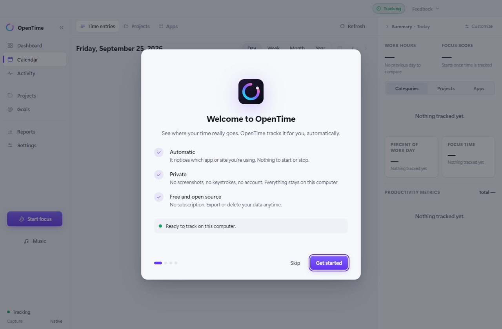

# OpenTime

**See where your time actually goes, automatically and privately.**

OpenTime is a free, open-source automatic time tracker for Windows. It quietly
notices which app or website you're using and turns your day into a timeline,
a focus score and simple reports. Think of it as a privacy-first Rize: no
account, no cloud, no AI, no screenshots, no subscription. Everything stays on
your computer.


---

## Download and install

1. **Download** `OpenTime-Setup-<version>.exe` from the
   [latest release](https://github.com/ElectricGamer61/OpenTime/releases/latest)
   (under **Assets**).
2. **Double-click it.** It installs for your account in a few seconds and opens
   by itself. No admin rights needed.
   - If Windows shows **"Windows protected your PC"**, click **More info**, then
     **Run anyway**. This appears because OpenTime is not code-signed yet (that
     costs money every year); it is not a virus warning.
3. **Answer four quick screens** (about 30 seconds): what OpenTime does, where
   things are, and a few choices like light or dark mode. That's it. It starts
   tracking right away, with an empty slate.

   

Windows 10 and 11 are supported. A macOS build is not available to download
yet; see [Running it from source](#running-it-from-source).

## Using it

- **Just use your computer.** Within a few minutes your day starts filling in on
  the **Calendar**. The **Dashboard** shows today at a glance.
- **Something labelled wrong?** Click the block and rename, split, merge,
  retime or delete it. Choose "remember this" and it's fixed for the future.
- **Want to focus?** Click **Start focus**, name the task, and pick a timer or
  Pomodoro. Turn on **distraction blocking** and sites like YouTube get covered
  until the session ends.
- **Closing the window doesn't stop tracking.** OpenTime keeps running in the
  system tray. `Ctrl+Alt+O` opens it from anywhere, `Ctrl+Alt+P` pauses it.

## Updating

Your data is never touched by an update.

- If you said yes to **"Tell me about updates"** during setup, an
  **Update to x.y.z** button appears at the top of the window when a new
  version is out. One click downloads it and restarts into it.
- Or check yourself: **Settings, Updates & feedback, Check now**.
- Or download the newest installer from the
  [releases page](https://github.com/ElectricGamer61/OpenTime/releases/latest)
  and run it over the old one.

## Feedback

Click **Feedback** at the top right of the app, or open an issue here:
[report a bug](https://github.com/ElectricGamer61/OpenTime/issues/new?template=bug_report.yml),
[suggest an idea](https://github.com/ElectricGamer61/OpenTime/issues/new?template=feature_request.yml),
or [ask a question](https://github.com/ElectricGamer61/OpenTime/issues/new?template=question.yml).

## Where your data lives, and uninstalling

Everything is plain files in `%APPDATA%\OpenTime\opentime`, one small JSON file
per day. **Settings, Your data** can open the folder, export CSV, make a full
backup, or restore one.

To uninstall, use **Windows Settings, Apps, OpenTime, Uninstall**. Your data
folder is kept, so reinstalling picks up where you left off. Delete the folder
too if you want it gone.

---

## Everything OpenTime does

**Tracking**
- Automatic app and website tracking: nothing to start or stop.
- Idle detection: time away from the keyboard is marked *Away*, never counted as work.
- Automatic categories and projects, with rules you teach it by correcting blocks.
- Private apps and private subjects that are never recorded at all.
- Pause from the tray or with `Ctrl+Alt+P`, for 15, 30 or 60 minutes or until you resume.
- Starts at sign-in, quietly in the tray (optional).

**Seeing your day**
- Calendar: your day as a timeline, by category, project or app. Day, week, month and year.
- Dashboard: time tracked, focus time, distraction, focus score, what stands out.
- Activity: every session, unfolded.
- Reports: any week, month, quarter, year or custom range.
- Insights: your best focus hours, meeting load, top distraction, compared with your own average.

**Fixing mistakes**
- Rename, split, merge, retime or delete any block, add time you spent away
  from the computer, or turn an *Away* block into work.

**Focus**
- Focus sessions: name the task, set a length, extend or stop anytime.
- Pomodoro: 25 minutes of focus, 5 minutes of break, repeating.
- Distraction blocking during focus sessions (optional): a list of sites and
  apps to cover, with "Allow 5 minutes" when you really need one.
- Break reminders after a long stretch without a break (optional).
- Ambient sounds and a small music player (lo-fi, whale song, alpha waves, classical).

**Goals**
- Daily or weekly targets, like "at least 4 hours of focus" or "at most 45
  minutes of distraction". No streaks, no guilt.

**Your data**
- Export sessions or daily summaries to CSV, full backup and restore, optional
  automatic clean-up of old days.
- Google Calendar overlay (optional, with your own free Google API key).

**Everything else**
- Light, dark, or match your system.
- One-click updates, and feedback straight from the app.

**What it deliberately does not do:** screenshots, keystroke logging, AI
summaries, accounts, cloud sync, team dashboards, or streaks. The reasons are in
[`docs/feature-inventory.md`](docs/feature-inventory.md).

---

## Contents

- [What it does](#what-it-does)
- [Running it from source](#running-it-from-source)
- [Architecture](#architecture)
- [Performance notes](#performance-notes)
- [Storage](#storage)
- [Your data](#your-data)
- [Google Calendar](#google-calendar)
- [Privacy](#privacy)
- [Packaging and releasing](#packaging-and-releasing)
- [Testing](#testing)
- [What is not built yet](#what-is-not-built-yet)
- [Relationship to the older Norte tracker](#relationship-to-the-older-norte-tracker)

A category-by-category account of what is shipped, what is deferred, and what
was left out on purpose is in [`docs/feature-inventory.md`](docs/feature-inventory.md).

---

## What it does

**Automatic tracking.** A background loop samples the OS focused window every few
seconds and groups consecutive samples into sessions. Nothing to start or stop.

**Idle detection.** When the OS reports no keyboard or mouse input for longer
than your threshold, the open session closes at its last observed sample and the
loop drops to a 30-second heartbeat that does nothing but watch for your return.
Time away is recorded as an explicit *Away* block, never as work.

**Categorisation.** Sessions resolve to a category through a fixed precedence:
an explicit per-app rule, then a learned keyword rule, then your project
keywords, then `Uncategorized`. Correct a block on the timeline, choose "Whole
app" or "Matching text", and the correction becomes a permanent rule.

**Focus and distraction.** Every session is classified productive / neutral /
distracting. The daily focus score is the productive share of tracked time,
scaled down by how fragmented that time was — the same four hours score worse
when they were chopped into forty pieces.

**Corrections that go beyond relabelling.** Split a block that was really two
pieces of work, merge blocks that were really one, delete one that should not
exist, add time that happened away from the machine, or claim an away block as
work — "I was in a meeting". Claiming a block removes it, so the same minutes are
never counted twice.

**Goals.** Floors and ceilings on a slice of time, daily or weekly. Progress is
paced against how much of the window has elapsed, so a weekly goal is not
"behind" every Monday by construction. No streaks, no badges, and both starter
goals ship switched off.

**Insights.** The few observations worth making out loud: when your focus
actually peaks, how fragmented the day was, what the meetings cost, and how today
compares to your *own* recent baseline. The panel renders nothing when there is
nothing worth saying.

**A day calendar, not a list.** The main view is an hour grid with a column per
kind of work: contiguous sessions fold into one entry, so a morning of real work
is a handful of readable blocks rather than fifty slivers. Folding never changes
a number — an entry's duration is the sum of the sessions in it, so the gaps
between them are still not credited as work. Click a block for the detail card:
what it was, how long, which apps and sites it was spent in, and the corrections.

**Summary column.** Pinned beside the grid: hours worked against yesterday,
progress against a goal you switched on, the day's breakdown as a donut by
category, project or app, and how the time was spent across focus, neutral,
distraction and away.

**Calendar overlay.** Meetings take their own column on the grid, drawn as plans
rather than records, so time in meetings and time in deep work are visible
against each other.

**Focus sessions.** Click **Start focus**, optionally name what you are about
to do, pick 25, 45, 60 or 90 minutes or Pomodoro, and the app gets out of the
way: a small bar with the countdown, a way to add fifteen minutes, and a way to
stop. Blocking distractions is one switch on the same sheet. It is
not a second tracker. Capture runs throughout exactly as it always does, and
ending the session *seals* it — the rows already recorded for those minutes are
stamped with the session's name, and only the minutes nothing was observed for
are filled in. So the session becomes one block on the timeline with the real
apps still underneath it, and none of the time is counted twice.

Pomodoro is just another length, not a second competing timer: 25 minutes of
focus, then a 5-minute break, repeating, with pause, skip, and stop. Only the
focus phases are tracked; a break is a real rest, not a session labelled
"break".


**Distraction blocking.** Optional, and only ever during a focus session. Put
sites (`youtube.com`, which covers its subdomains) or apps (`steam`) on a list,
and while a session runs, a blocked one in front gets covered by a calm
full-screen reminder of what you are focusing on and how long is left. It never
takes keyboard focus, so closing the tab or switching apps still works, and it
lifts the moment something else is in front. "Allow 5 minutes" lets one through;
"End focus session" ends it. OpenTime never closes or kills anything: it cannot
lose your work, and it needs no admin rights. See `src/core/blocking.ts`.

**Music.** Its own button on the sidebar, separate from Focus on purpose:
starting to focus is one decision, what to listen to is another. One short
list: music (lo-fi, whale song, alpha waves, an original classical-style motif)
and sounds (rain, waves, room tone, deep hum). Click one to play it, click it
again to pause, set the volume. It never touches your tracked time. Everything
except the whale song is generated on your machine from scratch; the whale
song is a public-domain NOAA field recording, bundled locally with its source
and license on record in [`docs/audio-licenses.md`](docs/audio-licenses.md).
Nothing is streamed.

**Reports over any range.** Week, month, quarter, year, or two dates you pick.
Stepping is by the calendar — the month before March is February, not thirty days
ago — and a custom range slides by its own length. Short ranges get a column per
day, a month also gets a real calendar grid, and a year gets a cell per day laid
out in week columns.

**Light and dark.** Both themes ship and both are looked at — `npx electron
scripts/screenshot.cjs <dir> --theme=both` captures each view in each, and
refuses to write a capture whose resolved `color-scheme` is not the one asked
for. Settings, General, Appearance follows the OS or pins one; first run asks.

**Export and backup.** Sessions CSV, a daily-summary CSV, and a full JSON backup
that restores everything. The data is one plain-JSON file per day in a folder you
can open, copy or delete.


---

## Running it from source

Requires Node 20+.

```bash
npm install          # the native capture module is an optionalDependency; a failure here is not fatal
npm run dev          # Vite dev server + esbuild watch + Electron
npm test             # unit tests (no Electron needed)
npm run typecheck    # tsc --noEmit
npm run build        # production build into dist/
npm start            # build, then run the app
```

Useful extras:

```bash
npm run package:win  # NSIS installer
npm run package:mac  # dmg
npx electron scripts/screenshot.cjs docs/screenshots   # capture the UI headlessly
```

### If OS capture is not available

`@miniben90/x-win` reads the focused window on Windows, macOS and X11. It cannot
work on Wayland, in containers, or over most remote sessions — Wayland does not
expose the focused window to other applications at all.

On those systems OpenTime does not fail: it falls back to a **demo capture
adapter**, and — only when capture is genuinely unavailable — seeds a fortnight of
realistic history so the app is usable and reviewable. That gate matters. Seeding
synthetic days into a working install would put fiction in someone's real
records; you can also switch seeding off in Settings and get an honest empty
dashboard instead.

Every synthetic row carries `source: 'demo'`, says so in the UI and in exports,
and **Settings → Your data → Remove demo data** deletes exactly the seeded days
plus any demo-adapter rows that landed in a real day. The demo data is generated
through the *real* `SessionBuilder`, so only the window samples are synthetic —
every line of categorisation, splitting and aggregation is the shipping code.

**macOS needs Accessibility**, and its absence is not obvious: without it `x-win`
still loads and still returns an app name while every window title comes back
empty, so the app looks like it is working and records nothing useful. OpenTime
checks the permission directly, says so on the Today view and in Settings, and
`Check again` rebuilds the capture adapter in place — no restart after granting
it.

One detail worth knowing: the native module is probed **in a child process**.
It is a Rust addon, and on an unsupported session it does not throw — it panics,
which aborts the host process. A panic unwinding through napi cannot be caught
by `try/catch`, so probing in-process would kill the app at boot on exactly the
machines that need the fallback. See `src/main/capture/index.ts`.

---

## Architecture

```
src/
  core/          pure logic — no Electron, no I/O, no DOM. Shared by main and renderer.
    types.ts       domain types (the IPC contract's vocabulary)
    day.ts         tracking-day math (configurable rollover hour, local time only)
    categorize.ts  rule precedence + productivity classification
    sessions.ts    SessionBuilder: samples in, batched sessions out
    aggregate.ts   every number the dashboard shows
    edits.ts       split / merge / retime / manual entry / claim an away block
    goals.ts       floors and ceilings on a slice of time
    insights.ts    the few observations worth making out loud
    export.ts      CSV and backup formats
    demo.ts        seeded generator for demo history and the demo adapter
    defaults.ts    factory settings, projects, seed rules, settings validation
  main/          Electron main process
    main.ts        window, tray, IPC, boot
    tracker.ts     the active/idle polling state machine
    capture/       Capture interface + native and demo adapters
    storage/       Storage interface + the sharded, journalled file store
    edits/         applying a correction to the store
    export/        turning the store into a file's worth of bytes
    calendar/      Google OAuth wiring and Calendar REST client
  preload/       contextBridge surface (the only thing the renderer can reach)
  renderer/      React 18 + Vite
    state/         one data hook, plus a browser-only fallback client
    lib/           entry folding and column layout, colour, formatting
    components/    day grid, detail popover, summary panel, charts, inspector
    views/         Dashboard, Calendar, Activity, Projects, Goals, Reports, Settings
  shared/ipc.ts  channel names and the typed API both sides implement
tests/           vitest, node environment
```

Three deliberate boundaries:

1. **`core/` imports nothing.** No Electron, no `fs`, no React. That is why the
   engine is testable without a display, and why the renderer can reuse the exact
   aggregation the main process would compute.
2. **Everything external to `Tracker` is injected** — capture source, idle
   seconds, storage, clock. The whole idle/active state machine runs in tests
   with a fake clock and no real timers.
3. **`Storage` is an interface**, and it exposes only append and per-day read.
   That is the entire query surface the engine needs, which is what makes the
   backend swappable.

Security posture in the renderer: context isolation on, node integration off, a
strict CSP in `index.html`, and `setWindowOpenHandler` sending external links to
the system browser instead of opening an in-app window.

---

## Performance notes

The predecessor to this app was sluggish, and most of that was things that had
no business being in a time tracker's process. The rules here:

**Nothing unrelated ships.** No browser automation, no webcam/vision pipeline,
no speech models, no agent framework, no video sub-application. Runtime
dependencies: **zero**, plus one optional native module for window capture.
React and Vite are dev dependencies that compile away into a single bundle.

**Writes are batched, and bounded.** `SessionBuilder` holds one session in memory
and only emits when the category changes, a sampling gap opens, or the caller
flushes — an hour of unbroken work is one write, not 720. Those writes go to an
append-only journal (a line each) and are checkpointed into per-day files on a
debounce, so the cost of a write is a few kB regardless of how much history you
have. A test asserts that a full minute of polling persists nothing.

**Idle costs nothing.** When the OS reports idle, the sampling interval is torn
down and replaced with a 30-second heartbeat that reads one integer. The capture
module is not touched at all while you are away, and neither is the disk.

**The renderer never aggregates in a component body.** Every summary comes from
a `useMemo` keyed on payload identity. The one per-second timer in the app lives
inside `NowCard`, so the ticking clock re-renders one component rather than the
dashboard. Timeline geometry is precomputed as fractions by `buildTimeline`, so
rendering is a multiply — no layout measurement, no `getBoundingClientRect`, no
resize observers.

**The bundle is one file.** ~223 kB of JS (~69 kB gzipped) and ~24 kB of CSS,
no code splitting: this loads over `file://`, so there is no network waterfall
to optimise and one file parses fastest. Main and preload are built separately
with esbuild in ~10 ms, so a renderer change never rebuilds the main process.

**The window is allowed to be throttled.** `backgroundThrottling` stays on;
tracking lives in the main process and does not need the window awake.

---

## Storage

Everything lives in one folder under Electron's `userData` directory
(`%APPDATA%/OpenTime/opentime` on Windows, `~/Library/Application Support/OpenTime/opentime`
on macOS):

```
opentime/
  meta.json              settings, projects, rules, goals  (small, always in memory)
  days/2026-08-03.json   one tracking day's sessions, idle blocks and events
  journal.jsonl          append-only log of writes not yet checkpointed
```

Plain JSON, readable without OpenTime, and yours to copy, sync or delete.

**Durability.** Every mutation is appended to `journal.jsonl` and awaited *before*
the call returns. Day files are written on a debounce. If the machine loses power
in between, `init()` replays the journal and the write is still there. Each
journal record carries a monotonic sequence and each day file records the highest
sequence already folded into it, so replay is idempotent — that is what makes
"append now, checkpoint later" safe rather than a way to double-count sessions.

**A bounded write.** Persisting one session rewrites one day file of a few kB, not
the whole history. The v0 store rewrote everything, so the cost of a write grew
with the length of your history — exactly backwards.

**A bounded footprint.** Days are loaded on demand and evicted, so a year of data
costs about the same memory as a week. Configuration stays resident because it is
read on every tick and is tiny.

**Failure is contained.** An unreadable `meta.json` costs your settings, not your
history. An unreadable day costs that day. Both are renamed aside for forensics
rather than crash-looping the app at boot.

Upgrading from the v0 single-file store happens once at boot; the original file is
renamed to `.migrated`, never deleted.

That shape is why `Storage` splits its getters: configuration is synchronous
because it is tiny and read constantly, while day records are asynchronous so a
backend is free to answer them from disk. A SQLite implementation would slot in
behind the same interface — it is no longer needed for durability or memory, only
for indexed cross-day queries when a reporting view wants them.

---

## Your data

**Export** (Settings → Your data):

| Format | For |
|---|---|
| Sessions CSV | one row per session — a spreadsheet, or an invoice |
| Daily CSV | one row per day — a quick chart of a quarter |
| JSON backup | everything, restorable — history, settings, projects, rules, goals |

CSV times are written in your local calendar rather than UTC, because an export
that renders as UTC is an export that gets mis-added. Fields beginning `=`, `+`,
`-` or `@` are prefixed with an apostrophe: window titles are attacker-influenced
(any web page picks its own) and spreadsheets execute those on open.

**Restore** validates the file, tells you how much history it holds, and asks
before replacing anything. Backups taken from the v0 store still restore.

**Retention** is optional and off by default. When on, days past the window are
deleted from disk rather than hidden — a retention setting that only hides data is
a lie about what is on disk. It is off by default because silently destroying
someone's history to satisfy a default is not something a local-first app gets to
do.

---

## Google Calendar

OpenTime ships **no API credentials**. You create a free OAuth client in your own
Google Cloud project and paste it into Settings; it is stored only in your local
settings file and sent nowhere but Google.

Setup:

1. Google Cloud Console → new project → enable the **Google Calendar API**.
2. Credentials → **OAuth client ID** → application type **Desktop app**.
3. Add `http://127.0.0.1:47813/oauth/callback` as an authorised redirect URI.
4. Paste the client ID and secret into OpenTime → Settings → Google Calendar,
   then press **Connect**.

Scope defaults to `calendar.readonly`, which is all the overlay needs and is the
lighter path through Google's verification review. Read-write is selectable for
future write-back features.

Two implementation details, both carried over from a previous implementation
that had already hit them:

- **The auth window presents a Chrome user agent.** Google rejects OAuth in a
  window advertising Electron's default UA. The flow runs in a dedicated
  `BrowserWindow` presenting a normal Chrome UA while sharing the default
  session, so an existing Google login carries over.
- **Tokens refresh five minutes before expiry**, and an `invalid_grant` (the
  user revoked access) flips the account to disconnected instead of retrying a
  grant that will never succeed again.

Plain `fetch`, no `googleapis` SDK — one HTTP call does not justify several
megabytes in a process we want to stay small.

Without credentials you can still add events manually (`addManualEvent`), and
the demo history includes plausible meetings so the overlay is visible.

---

## Privacy

- **No screenshots, ever.** OpenTime records metadata, not pixels.
- **URLs are reduced to the host.** `https://mail.example.com/inbox/thread?token=…`
  is stored as `mail.example.com`. Paths, query strings and fragments are
  discarded before anything is persisted, so a session token or a document title
  cannot end up in the store. A test asserts this.
- **URL reading happens for browsers only** — it forces the accessibility tree
  on, so it is not done for other applications.
- **Private apps.** Anything on the ignore list is never recorded, and any open
  session closes the moment it takes focus.
- **Private subjects.** A client name, a matter number, a health portal — any
  window whose title or host contains one of your keywords is never recorded, in
  *any* application. Applications are the wrong unit for confidentiality; the
  subject is the right one.
- **No telemetry, no analytics.** The only network calls are to Google's own
  OAuth and Calendar endpoints, only after you connect an account, and a check
  with GitHub for a newer version, only if you turned update checks on. It
  sends nothing about you.
- **OpenTime never tracks itself.**


---

## Packaging and releasing

`electron-builder` is configured in `electron-builder.cjs` (a file rather than
package.json's `build` key so `signAndEditExecutable` can vary by host — see
below; electron-builder only discovers a config file named exactly
`electron-builder.<ext>`, not `electron-builder.config.<ext>`). Targets: NSIS
on Windows (one-click, per-user, no admin prompt), dmg on macOS.

```bash
npm run package:win
npm run package:mac
```

### Releasing a version

1. `npm version 0.4.0 --no-git-tag-version`, commit, and merge to `main`.
2. Tag it: `git tag v0.4.0 && git push origin v0.4.0`.

`.github/workflows/windows-package.yml` builds and verifies the installer on a
real Windows runner, checks that the tag matches `package.json`, and publishes a
GitHub Release named `OpenTime 0.4.0` with `OpenTime-Setup-0.4.0.exe`, its
`.blockmap`, and `latest.yml`. Installed copies with update checks on see it
within hours; everyone else sees it on **Check now**.

The updater (`src/main/updater.ts`, `electron-updater`) only ever downloads
after a click, verifies the download against the sha512 in `latest.yml`, flushes
every pending write, then runs the installer silently and relaunches. The data
folder is never part of an install. Only an installed Windows build updates
itself; dev runs and unsigned macOS builds point at the releases page.

To try the whole flow without publishing anything, serve a folder holding a
newer build's installer, blockmap and `latest.yml`, and start an installed copy
with `OPENTIME_UPDATE_FEED=http://127.0.0.1:<port>/`.

The repository has to be public for people (and the updater) to download
releases.

### App icon

`build/icon.svg` is the hand-authored source: an open ring (a clock face left
unclosed) swept cyan to violet to pink on a deep night tile, ending in a dot
that marks "now". The in-app mark (`BrandMark`) is the same drawing.
`build/tray.svg` is the ring alone, drawn heavier for the tray. `npm run icons`
renders every packaged raster from them: `icon.ico`
(Windows — installer, uninstaller, both shortcuts, and the exe itself),
`icon.icns` (macOS), `icon.png` (the runtime window/taskbar icon), and
`tray/{16,20,24,32,40,48}.png` (one exact-pixel representation per tray scale
factor — Electron does not resize a `Tray` image itself, so a single upscaled
bitmap reads visibly soft on HiDPI). `src/main/icon.ts` resolves these at
runtime in both dev and packaged builds; `tests/icons.test.ts` regenerates
every raster and byte-compares it against what's committed, so an edited SVG
that was never re-run through `npm run icons` fails CI instead of shipping a
stale icon. Edit either SVG, run `npm run icons`, commit the
regenerated files alongside it.

Notes for a real release:

- **Windows** is the priority target. The build is per-user, so it needs no
  administrator rights. Set an AppUserModelID before shipping notifications so
  they attribute correctly in the Action Center.
- **macOS** builds must be produced on macOS. Shipping outside the App Store
  requires an Apple Developer ID, codesigning and notarisation; unsigned builds
  are quarantined by Gatekeeper. macOS also gates window-title access behind
  **Accessibility** permission — the app must request it and degrade gracefully
  until it is granted.
- **The native capture module is per-platform.** `@miniben90/x-win` ships
  prebuilt binaries; build each installer on (or cross-build for) its target and
  verify the `.node` binary is present in the packaged app.
- **Building the NSIS installer on Linux needs Wine.** `npm run package:win`
  produces a real `release/win-unpacked/OpenTime.exe` on any host, but wrapping
  it into `OpenTime-Setup-<version>.exe` invokes `nsis-resources`, which
  electron-builder can only run through Wine when the host OS is not Windows.
  `electron-builder.cjs` sets `win.signAndEditExecutable` to `true` only when
  actually running on Windows (`process.platform === 'win32'`) — real hardware
  or the `windows-latest` CI runner — so rcedit (which stamps `icon.ico` and
  the version resources into the exe) runs wherever it can. Without Wine (no
  `sudo` in a sandboxed environment, say), that conditional still lets the
  unpacked app build to completion with the correct extraResources icon
  assets, but its raw exe keeps Electron's default icon until rcedit runs on
  a Windows host, and the NSIS step itself fails outright with
  `wine is required`. Build the installer on Windows, on a Linux host with
  Wine installed, or in CI. `win-unpacked` was verified end to end this way:
  launched directly under WSL2 (the packaged `.exe`, not `electron .`, with
  `--user-data-dir` pointed outside the real profile), it booted, detected
  capture was unavailable, seeded gated demo data, and wrote real sharded day
  files through the same storage path dev mode uses. The `windows-package.yml`
  workflow additionally installs the real NSIS output and samples the icon
  colour on the installer, the installed exe, the uninstaller, and both
  shortcuts to confirm the brand mark actually reached each one.
- **Auto-update is not wired up.** For an open project the natural choice is
  `electron-updater` against public GitHub Releases; v0 deliberately ships
  without it rather than with a feed only the author can publish to.

---

## Testing

```bash
npm test
```

344 tests, node environment, no Electron and no display required:

| Suite | Covers |
|---|---|
| `day.test.ts` | day-key bucketing, boundary rollover, local-vs-UTC correctness, ranges |
| `categorize.test.ts` | rule precedence, URL host reduction, productivity classification, private apps and subjects |
| `sessions.test.ts` | session batching, gap splitting, day-boundary splitting, noise rejection, live rule changes |
| `aggregate.test.ts` | daily/weekly rollups, focus runs, focus-score properties, timeline geometry |
| `format.test.ts` | duration/clock/percent presentation, the 60th-minute carry, hex-to-wash fills |
| `storage.test.ts` | sharding, journal crash recovery, idempotent replay, corrupt-file containment, cache eviction, v0 migration, retention, restore |
| `tracker.test.ts` | the full active/idle state machine with an injected clock and fake capture, timed pause, adapter swap, drain-before-quit |
| `edits.test.ts` | split/merge/retime/manual/claim arithmetic and every rejection case |
| `main-edits.test.ts` | corrections and exports end to end against a real store |
| `export.test.ts` | CSV escaping and formula-injection defence, backup round-trip, hostile and v1 backups |
| `goals.test.ts` | floors, ceilings, pacing, weekly windows, sanitisation |
| `insights.test.ts` | hourly attribution, peak window, and the conditions under which each insight fires |
| `settings.test.ts` | validation of every settings value that could wedge the engine |
| `calendar.test.ts` | OAuth URL construction, refresh margin, event mapping, revoked grants, network and malformed-response failures |
| `demo.test.ts` | the demo generator produces real, non-overlapping, deterministic days |
| `focus.test.ts` | sealing a focus session: boundary splits, no time lost or duplicated, gap filling, idempotent re-seal |
| `music.test.ts` | track validation, default track, volume clamping |
| `pomodoro.test.ts` | presets, custom-plan validation and bounds, countdown arithmetic, phase alternation |
| `range.test.ts` | calendar month/quarter/year arithmetic, custom-range clamping, DST-safe enumeration, the month grid |
| `entries.test.ts` | folding adjacent sessions into calendar entries, lane assignment, focus-session grouping |
| `palette.test.ts` | category-to-colour mapping, contrast-safe labels, edge-bar colour, light/dark RGB conversion |
| `styles.test.ts` | design-token integrity: no self-referencing `light-dark()` tokens, no undefined token reads, no invalid `auto-fit` grids |

Those cover the engine. The *product* is covered by a second suite:

```bash
npm run test:e2e
```

`scripts/e2e.mjs` boots the real main process against a throwaway user-data
directory and drives the renderer over the Chrome DevTools Protocol the way a
person would — clicking tabs, clicking timeline blocks, ctrl-clicking to merge,
typing into the inspector, flipping the theme — asserting through the same IPC
surface the UI uses. 56 checks, and it writes a screenshot of each view beside
`results.json` so a run can be looked at as well as read.

The tracker tests drive the engine at its real polling cadence rather than in
one jump — ticking in a single leap would look like a sampling gap and split the
session, which is correct behaviour but not what those tests are checking.
Storage writes are asynchronous and durable, so those tests await `tracker.drain()`
before asserting: the same ordering the app uses on quit.

---

## What is not built yet

Honest list of what a production release still needs. The full account, including
what was left out on purpose and what should be reworked, is in
[`docs/feature-inventory.md`](docs/feature-inventory.md).

- **Code signing.** Unsigned Windows installers trigger a SmartScreen prompt
  on first run ("More info", "Run anyway"). Signing, and notarisation, is also
  required before macOS distribution and macOS self-updates.
- **Calendar write-back.** Read-only today; the scope is already selectable.
- **SQLite backend.** No longer needed for durability or memory — the sharded,
  journalled store fixed both. It would buy indexed cross-day queries, worth doing
  when a reporting view needs them.
- **Accessibility audit.** Keyboard navigation and focus order are reasonable but
  unaudited.
- **Long-run soak test.** The engine is designed for a fixed memory ceiling and
  the store now has a bounded footprint, but neither has been run for days on real
  hardware.


---

## Relationship to the older Norte tracker

OpenTime is a fresh codebase, not a port. What was reused is *design knowledge*
from a previous Electron tracker by the same author, adapted and re-implemented
in TypeScript, with attribution in comments at each site:

- the two-mode active/idle polling state machine, and resuming promptly on
  `powerMonitor` `resume`/`unlock-screen` rather than waiting out the heartbeat;
- batching sessions in memory and flushing on category change or gap;
- reducing URLs to the host, and only reading them for browsers;
- splitting sessions at the tracking-day boundary, and doing day-key maths in
  local time — the predecessor shipped a UTC-based key and had to write a
  migration to repair it, which is why `day.ts` has tests for exactly that case;
- the rule-precedence categoriser;
- the Google OAuth user-agent workaround and token-refresh behaviour.

What was deliberately left behind: the webcam presence pipeline, the voice
assistant, the agent framework, the bundled automation browsers, the video
sub-application, the hosted Postgres dependency, and the multi-app monorepo.
Those were the weight, and none of them belong in a time tracker.

No part of any commercial tracker's branding, copy, visual design or internals
was used. The product category — automatic tracking with a calendar overlay and
a focus score — is not itself anyone's property; the identity, wording, visual
language, scoring model and implementation here are original.

---

Apache License 2.0. See [`LICENSE`](LICENSE) and [`NOTICE`](NOTICE). Every
bundled dependency is MIT; the one non-original asset (a public-domain NOAA
recording used by the ambient music player) is documented separately in
[`docs/audio-licenses.md`](docs/audio-licenses.md).
